# Report for EI339 Final Project
Aim at solving Sudoku from input image, by python.

## Overview
One raw picture of Sudoku should firstly be transformed to a standard decent image of the main part of Sudoku. Then some tricks of image processing will be applied to extract each cell with number in the Sudoku. A CNN model is trained to recognize those digits. After that, the Sudoku is stored in the program, and can be easily solved by searching methods.

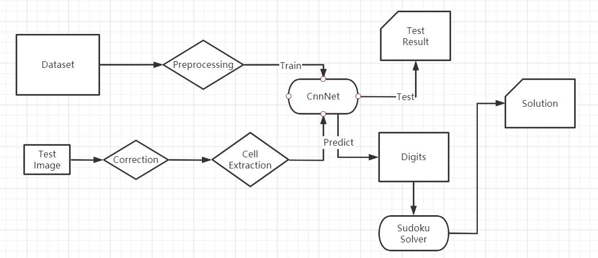
<div STYLE="page-break-after: always;"></div>
## CNN Model
I will give the details of the CNN model in this part, including **data processing**, **model construction**, **model training** and **model testing**.

- Data Processing<br/>
  Our data come from the *MNIST* dataset and the self-made Chinese dataset. In this project, only "0" to "9" and "一" to "九" are needed. Before other works, these data should be normalized such that each image meets the requirements:

   1. white character with black background; (by cv2.threshold)
   2. size of $28\times28$; (by cv2.resize)
   3. each pixel between 0 and 1; (by dividing 255 as float type)

  After the processing, all the data are saved in pickle format. And the code is in *Data_prepare.py*.

- Model Construction<br/>
  This model is based on LeNet, which is the basic form of CNN. After the improvement during these years, there're many new features adding to the net.

  My CNN model is designed to have 3 layers of convolution, relu-activation, max-pooling and dropout, with 2 layers of full-connection. 
  
  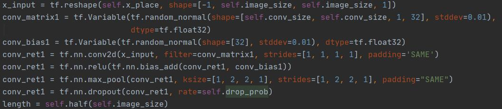
  
  The model is shown below: (Drawn by *utils.draw_cnn_model.py*)
  
  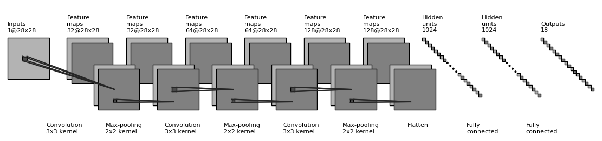
  
  The output of 18 dimensions is taken as the probabilities on each classes by SoftMax.
  
  The convolution here doesn't change the size of matrix because the stride length is set as 1. Usually in CNN, the convolution operation should change the size in order to obtain features in different scales, but here the input images are of similar scale of view. 
  
  The code is in *utils.CNN_Model.py*
<div STYLE="page-break-after: always;"></div>

- Training<br/>
  With help of Tensorflow, the update of parameters is not my concern, and I only need to feed the training data into the model.
  
  As mentioned above, the dataset is a bit imbalance. So, each time the one batch of random chosen data will be fed into the model, which makes the data more uniformly distributed.
  
  The loss curve and accuracy curve are shown in the figure:
  
  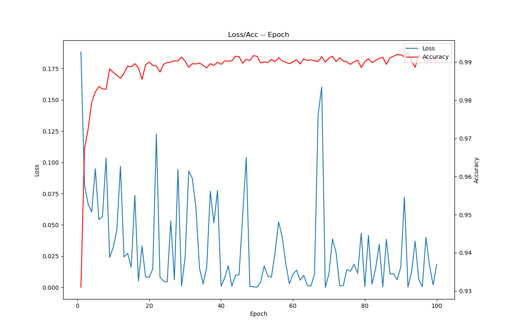
  
  Since the dataset is not big and a bit different from the real situations, I decide not to train the model for a large amount of epochs, in case of overfitting. Also it converges really fast.
  
  And I've tried different hyperparameters like the size of convolution kernel and the number of hidden units in fully connected layers. The result shows the current setting  is nearly the best.
<div STYLE="page-break-after: always;"></div>
- Testing<br/>
  The result of testing is shown in the chart:
  
  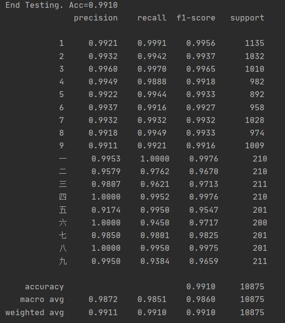
  
  From the result we can see that, the precision of Arabic numbers is higher than that of Chinese numbers, which is most likely due to the distribution of dataset, because in later test, the performance on Chinese numbers is better.
  
  In conclusion, the performance of the model is barely satisfactory, since one Sudoku may become unsolvable if one given number is misunderstood. But that's almost the best of a personal CNN model. (Code is in *CNN_train_test.py*)
<div STYLE="page-break-after: always;"></div>
## Image Processing
This part is about the processing of raw input images. The main procedures are as follows:

  1. Correct the raw image.<br/> Firstly, try to find the biggest contour in this image, and use that contour to transform the image to a front view version. 

  2. Extract Cells.<br/> For convenience of digit recognition, each cell should be extracted separately. This is easy to do when the image is transformed into a front view, by dividing the whole image into $9\times9$ grids. 

     Also, the cell should be decided whether it contains a number, which depends on the ratio of inside pixels. So, the part which is connected to the borders will be cleared from the image to only keep the main digit part.

  3. The valid cells will go through the same preprocessing function as the train data for CNN, and then be fed into the model to get prediction results.

Detail images of intermediate steps and solution are shown below, and these are also the test results for reference image: (Code is in *utils.sudoku_extract.py*)

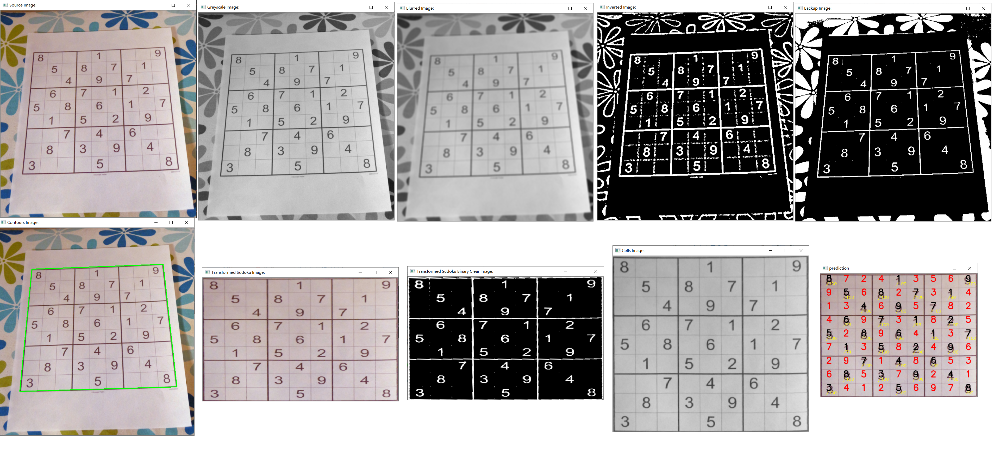
<div STYLE="page-break-after: always;"></div>
## Sudoku Solve
After getting all the given information, the problem is how to solve it.

Generally, the Sudoku can be seen as a CSP problem, which can be solved by some searching methods. Here I use the simple **DFS** strategy to solve it. (Code is in *utils.sudoku_solve.py*)
```python
def sudoku_solve() -> bool:
    global board, rows, cols, blocks, blanks
    if not len(blanks):
        print("Sudoku Solved")
        return True
    if not sudoku_check():
        return False
    blanks.sort(
        key=lambda x: len(rows[x.r]) + len(cols[x.c]) + len(blocks[x.b]), 
        reverse=True
    )
    blank = blanks[0]
    range_list = blank_range(blank)
    for num in range_list:
        blanks.remove(blank)
        rows[blank.r].append(num)
        cols[blank.c].append(num)
        blocks[blank.b].append(num)
        board[blank.r][blank.c] = num
        if sudoku_solve():
            return True
        blanks.append(blank)
        rows[blank.r].remove(num)
        cols[blank.c].remove(num)
        blocks[blank.b].remove(num)
        board[blank.r][blank.c] = None
    return False
```
The idea is to maintain the existing numbers in each **row**, **column** and **block**. Use **DFS recursion** to try every possible choice. 

If there's something wrong (no left choices or duplicate numbers) during the recursion, it means the Sudoku is **unsolvable**.
<div STYLE="page-break-after: always;"></div>
## The Reference Code
The above is all about my project. At below I will give the result of reference code.

The reference code uses a roughly same procedure as mine.

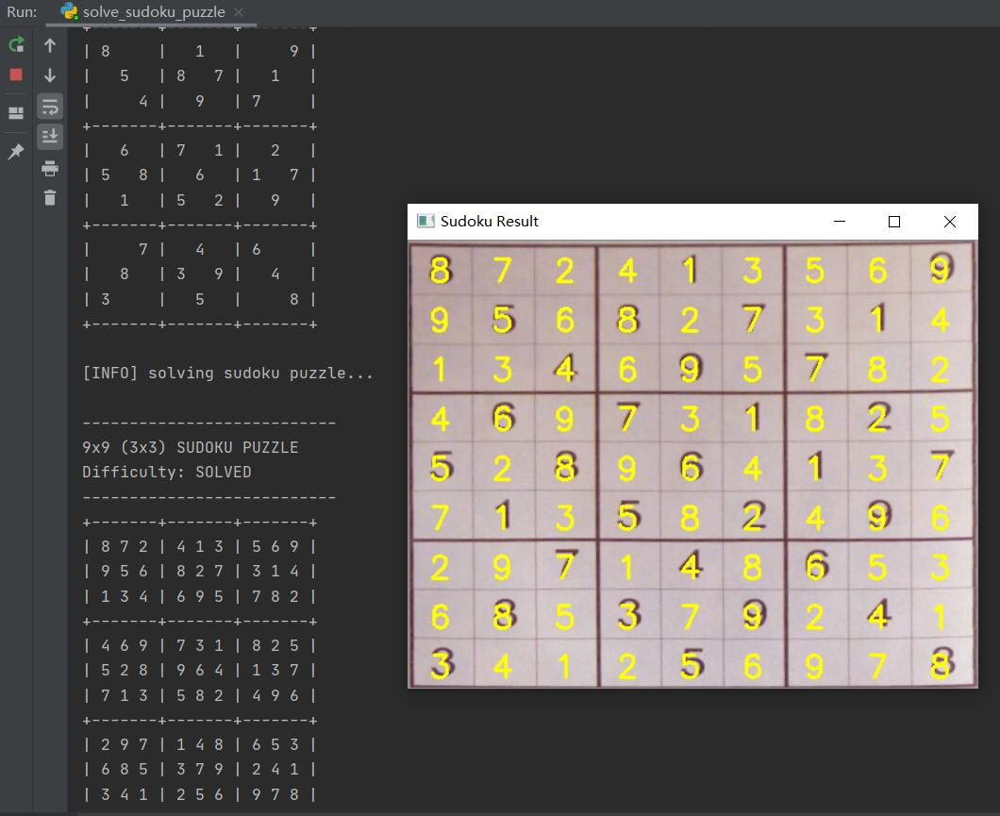
<div STYLE="page-break-after: always;"></div>
## Tests & Improvements in Real Use
Several test images are used to evaluate the performance.

1. The test image from reference project.<br/>
    The result of this image has been shown above. The result is satisfying, but I have to admit that it's a coincidence. Since the digits in this image are of print form, it's hard to apply a model trained by handwritings.
    
2. The test images from TAs.<br/>
    Since the images are handwritten, the position of digits are not absolute centric. So, the method of extracting cells should be changed. 
    
    As mentioned above, the cells are divided by position, and the part connected with borders should be cleared out. However, the handwritten digits usually touch the border, so the method should be replaced by some **heuristic** policy.
    
    After observing the handwritten pattern, I find that the digits are in the right bottom part of cells. So, I set a relative rectangle corresponding to that part to extract the main digit of a cell. This looks less reasonable, but works really well. (Sometimes there's a line on the bottom, but it cause little damage to the prediction.)
    
    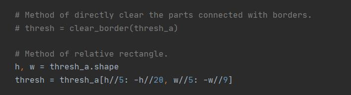
    
    Also, the thickness of digits in test images is far lower than training images. So, here I use the **cv2.erode** function to make the writing bold enough for recognition. 
    
    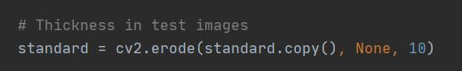
    
    Besides, the test results turn out to be unsatisfying, since one false identification may cause the whole Sudoku to be unsolvable. So, I add a step to correct the known digits.
    
    At first I plan to implement this step as this: Record the scores of each known digits from the prediction, and when the Sudoku turns to be invalid, the digit with lowest score will be tested for other possible numbers. But later I find that some digits with relatively high scores will also be wrong. <br/>
    Then I use an easier way to correct the digits, which is **user input**. When the user find something wrong in the recognized Sudoku, he can change it by inputting the right digit and position. This still looks trivial, but is pretty useful.
<div STYLE="page-break-after: always;"></div>
## Test Results
For each test image, I will give the **cleared image**, the **extracted cells**, the **predicted puzzle**, and the **result image** (maybe after correction if the prediction is partly wrong).

(The Arabic number with quotes means Chinese character.)

### 1-1
There're **Five** wrong predictions.
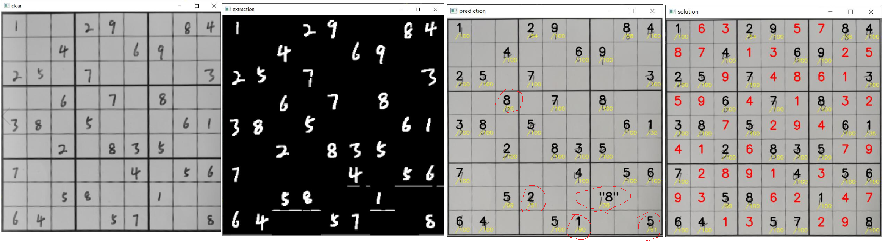

### 1-2
There're **Two** wrong predictions.
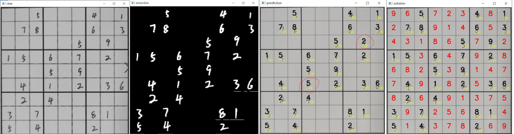

### 1-3
There're **Two** wrong predictions.
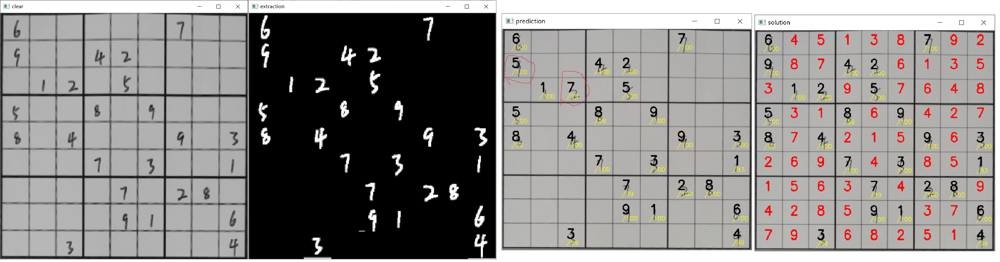

### 1-4
There're **Two** wrong predictions.
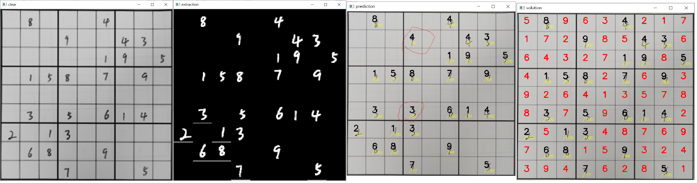

### 1-5
There're **Four** wrong predictions. After correction, it's still unsolvable.
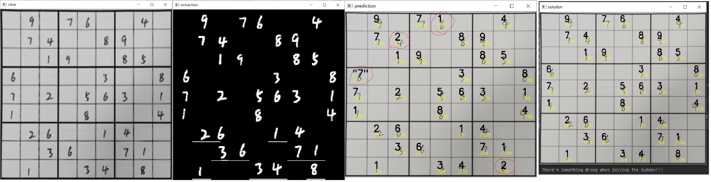

### 2-1
There're **No** wrong predictions.
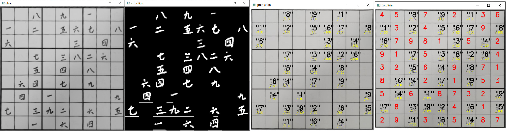

### 2-2
There're **One** wrong predictions.
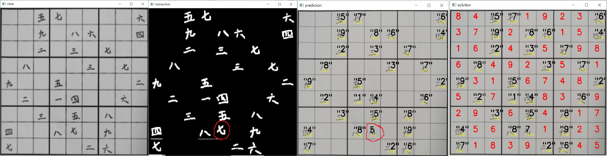

### 2-3
There're **No** wrong predictions.
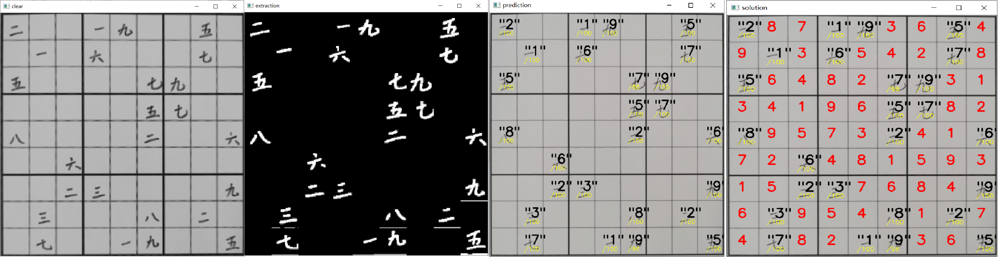

### 2-4
There're **No** wrong predictions.
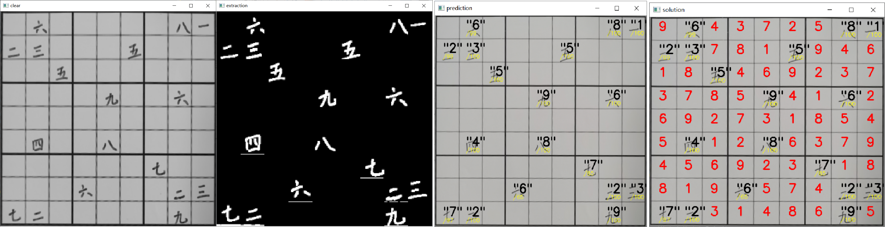

### 2-5
There're **No** wrong predictions. After correction, it's still unsolvable.
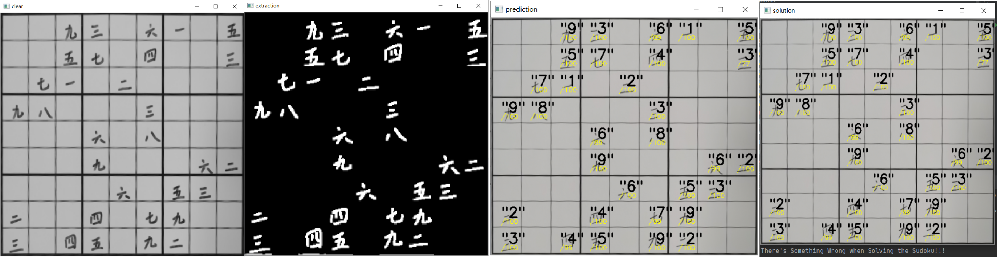

## Conclusion
The whole project is enough for real use. The shortcoming is about the **dataset** and the method of **extracting digits **from images. For standard Sudoku images, the cells should be extracted by borders, while in handwritten Sudoku images by relative position. 

The method of **solving Sudoku** is also improvable, by applying some data structure like dancing link, or using C++ DLL for higher speed. 